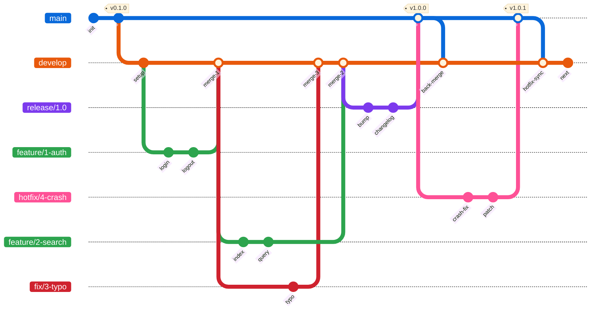

<div align="center">

# Git Workflow — Claude Code Skill

[](https://github.com/qubernetic-org/git-workflow-agent-skill/actions/workflows/lint.yml)
[](CHANGELOG.md)
[](LICENSE)
[](https://claude.ai/code)
[](https://conventionalcommits.org)
[](https://nvie.com/posts/a-successful-git-branching-model/)
[](https://semver.org)

A Claude Code skill that enforces a disciplined Gitflow-based development workflow with conventional commits, semantic versioning, and issue-driven branching.

[Installation](#installation) · [Usage](#usage) · [What It Enforces](#what-it-enforces) · [Contributing](CONTRIBUTING.md) · [Onboarding](ONBOARDING.md)

</div>

---

## Installation

Clone the repo and run the install script for your platform. The script creates a **symlink**, so the skill stays in sync with the repo automatically.

### Linux

```bash
git clone https://github.com/qubernetic-org/git-workflow-agent-skill.git
cd git-workflow-agent-skill
./scripts/install_linux.sh
```

### macOS

```bash
git clone https://github.com/qubernetic-org/git-workflow-agent-skill.git
cd git-workflow-agent-skill
./scripts/install_macos.sh
```

### Windows (PowerShell)

```powershell
git clone https://github.com/qubernetic-org/git-workflow-agent-skill.git
cd git-workflow-agent-skill
.\scripts\install_windows.ps1
```

> **Note:** Windows symlinks require Developer Mode enabled or an elevated terminal. The script falls back to a file copy if symlinks are unavailable.

### Uninstall

```bash
# Linux
./scripts/install_linux.sh --uninstall

# macOS
./scripts/install_macos.sh --uninstall
```

```powershell
# Windows
.\scripts\install_windows.ps1 -Uninstall
```

### Manual Installation

If you prefer not to use the scripts:

```bash
mkdir -p ~/.claude/skills/git-workflow
ln -s "$(pwd)/SKILL.md" ~/.claude/skills/git-workflow/SKILL.md
```

The skill will be automatically discovered on the next Claude Code session.

## Usage

The skill activates automatically when you ask Claude Code to perform any git operation:

```
> Commit my changes
> Create a branch for this feature
> Prepare a release for version 1.2.0
> I need to hotfix a production bug
```

Or invoke directly:

```
/git-workflow
```

## What It Enforces

| Rule | Description |
|------|-------------|
| **Gitflow branching** | `main`, `develop`, `feature/*`, `fix/*`, `hotfix/*`, `release/*` |
| **Conventional Commits** | Structured messages — `feat:`, `fix:`, `docs:`, `chore:`, etc. |
| **Atomic commits** | One logical change per commit, no mixed concerns |
| **`--no-ff` merges** | All merges into protected branches preserve branch topology |
| **No AI signatures** | No "Co-Authored-By" or "Generated by" lines |
| **Semantic Versioning** | `MAJOR.MINOR.PATCH` with proper bump rules |
| **Issue-driven workflow** | Every branch starts from an issue and closes it via PR |
| **PR-only merges** | `main` and `develop` are never committed to directly |
| **Conventional PR titles** | PR titles follow Conventional Commits format |

## Branch Model



| Pattern | Base | Merges into | Purpose |
|---------|------|-------------|---------|
| `feature/<issue>-<slug>` | `develop` | `develop` | New features |
| `fix/<issue>-<slug>` | `develop` | `develop` | Bug fixes |
| `hotfix/<issue>-<slug>` | `main` | `main` + `develop` | Urgent production fixes |
| `release/<version>` | `develop` | `main` + `develop` | Release preparation |

## Commit Format

```
<type>(<optional scope>): <description>
```

```
feat(auth): add OAuth2 login flow
fix: resolve race condition in websocket reconnect
chore(release): prepare 1.2.0
feat!: drop support for Node 16
```

See [SKILL.md](SKILL.md) for the full specification including commit types, breaking change conventions, versioning rules, release processes, and the complete forbidden operations list.

## Why This Workflow?

| Aspect | This Skill (Gitflow) | GitHub Flow | Trunk-Based |
|--------|---------------------|-------------|-------------|
| **Branches** | `main` + `develop` + typed branches | `main` + feature branches | `main` only |
| **Releases** | Explicit release branches with version bump | Deploy from main on merge | Continuous deploy from main |
| **Commit style** | Conventional Commits (enforced) | Free-form | Free-form |
| **Merge strategy** | `--no-ff` merge commits (preserves topology) | Squash merge (flat history) | Squash or rebase |
| **Traceability** | Issue → branch → PR → changelog | PR-based | Commit-based |
| **Best for** | Versioned releases, libraries, skills, APIs | SaaS with continuous deploy | Small teams, rapid iteration |

### When to use Gitflow

- You ship **discrete versions** (v1.0, v1.1, v2.0) rather than continuous deploys
- You need a **clear audit trail** from issue to release
- Multiple features develop **in parallel** with different release timelines
- You want **hotfix capability** without disrupting in-progress work

### When NOT to use Gitflow

- You deploy to production on every merge (GitHub Flow is simpler)
- You have a single developer with no parallel work streams
- Your project doesn't use semantic versioning

## Contributing

See [CONTRIBUTING.md](CONTRIBUTING.md) for guidelines and [ONBOARDING.md](ONBOARDING.md) for a new contributor guide.

## License

[MIT](LICENSE) © [Qubernetic](https://github.com/qubernetic-org)
