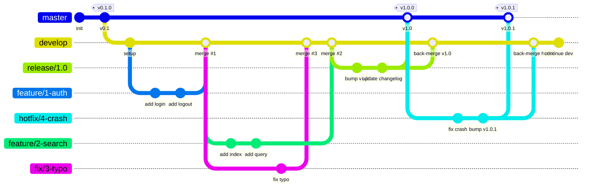

<div align="center">

# Git Workflow — Claude Code Skill

[](CHANGELOG.md)
[](LICENSE)
[](https://claude.ai/code)
[](https://conventionalcommits.org)
[](https://nvie.com/posts/a-successful-git-branching-model/)
[](https://semver.org)

A Claude Code skill that enforces a disciplined Gitflow-based development workflow with conventional commits, semantic versioning, and issue-driven branching.

[Installation](#installation) · [Usage](#usage) · [What It Enforces](#what-it-enforces) · [Contributing](CONTRIBUTING.md)

</div>

---

## Installation

Copy the `SKILL.md` file to your global Claude Code skills directory:

```bash
mkdir -p ~/.claude/skills/git-workflow
cp SKILL.md ~/.claude/skills/git-workflow/SKILL.md
```

The skill will be automatically discovered on the next Claude Code session.

## Usage

The skill activates automatically when you ask Claude Code to perform any git operation:

```
> Commit my changes
> Create a branch for this feature
> Prepare a release for version 1.2.0
> I need to hotfix a production bug
```

Or invoke directly:

```
/git-workflow
```

## What It Enforces

| Rule | Description |
|------|-------------|
| **Gitflow branching** | `master`, `develop`, `feature/*`, `fix/*`, `hotfix/*`, `release/*` |
| **Conventional Commits** | Structured messages — `feat:`, `fix:`, `docs:`, `chore:`, etc. |
| **Atomic commits** | One logical change per commit, no mixed concerns |
| **`--no-ff` merges** | All merges into protected branches preserve branch topology |
| **No AI signatures** | No "Co-Authored-By" or "Generated by" lines |
| **Semantic Versioning** | `MAJOR.MINOR.PATCH` with proper bump rules |
| **Issue-driven workflow** | Every branch starts from an issue and closes it via PR |
| **PR-only merges** | `master` and `develop` are never committed to directly |
| **Conventional PR titles** | PR titles follow Conventional Commits format |

## Branch Model



| Pattern | Base | Merges into | Purpose |
|---------|------|-------------|---------|
| `feature/<issue>-<slug>` | `develop` | `develop` | New features |
| `fix/<issue>-<slug>` | `develop` | `develop` | Bug fixes |
| `hotfix/<issue>-<slug>` | `master` | `master` + `develop` | Urgent production fixes |
| `release/<version>` | `develop` | `master` + `develop` | Release preparation |

## Commit Format

```
<type>(<optional scope>): <description>
```

```
feat(auth): add OAuth2 login flow
fix: resolve race condition in websocket reconnect
chore(release): prepare 1.2.0
feat!: drop support for Node 16
```

See [SKILL.md](SKILL.md) for the full specification including commit types, breaking change conventions, versioning rules, release processes, and the complete forbidden operations list.

## Contributing

See [CONTRIBUTING.md](CONTRIBUTING.md) for guidelines.

## License

[MIT](LICENSE) © [Qubernetic](https://github.com/qubernetic-org)
